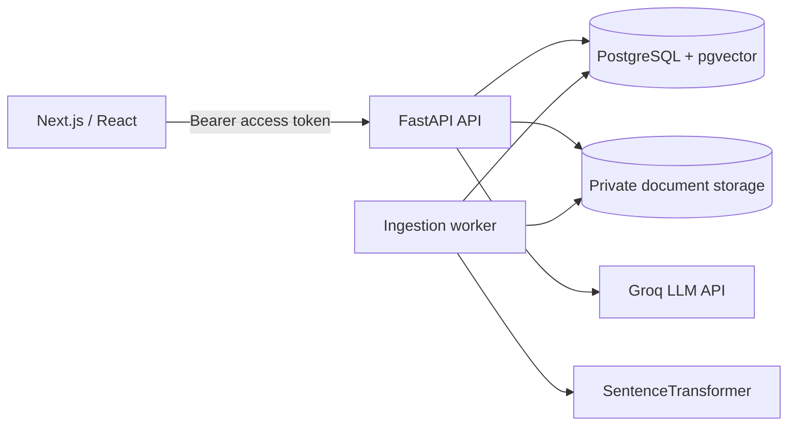
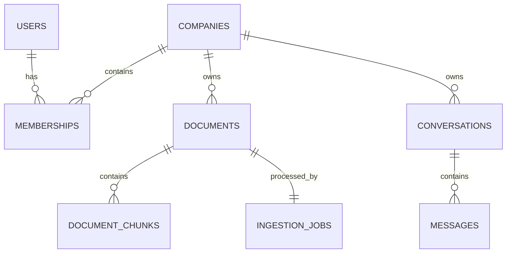

# Enterprise AI Platform

A multi-tenant internal knowledge platform that ingests company documents and
answers employee questions with retrieval-augmented generation (RAG), grounded
citations, conversation history, and role-based access control.

The project is designed as a portfolio-scale modular monolith: understandable,
testable, and deployable without introducing infrastructure that its workload
does not justify.

## Problem

Internal policies are often distributed across documents and difficult to
search. This application gives each organization an isolated workspace where
authorized users can upload documents and ask questions. Answers are generated
only from retrieved organization content and include source chunks.

## Implemented features

- Global user identities with multi-organization memberships
- Owner, admin, and member authorization enforced by FastAPI
- Short-lived JWT access tokens and rotating, revocable refresh sessions
- Tenant-scoped document, vector, conversation, and analytics access
- Durable asynchronous PDF, DOCX, text, and Markdown ingestion
- SHA-256 duplicate detection and pending/processing/completed/failed states
- SentenceTransformer embeddings and PostgreSQL/pgvector cosine search
- Grounded Groq LLM answers, chunk/page citations, and abstention
- Prompt-injection boundaries treating documents as untrusted content
- Persisted conversations and message citation snapshots
- Version-controlled RAG evaluation cases
- Next.js dashboard for auth, users, documents, ingestion, and chat
- Structured logs, request IDs, readiness checks, and practical rate limiting
- Full-stack Docker Compose and GitHub Actions CI

## Architecture



The API and worker use the same Python codebase but run as separate processes.
PostgreSQL stores both application data and durable ingestion jobs. This avoids
adding Redis, Kafka, microservices, or Kubernetes to a workload that does not
need them.

Detailed decisions: [`docs/ARCHITECTURE.md`](docs/ARCHITECTURE.md).

## Technology stack

| Layer | Technology |
|---|---|
| Frontend | Next.js 16, React 19, TypeScript, Tailwind CSS, TanStack Query |
| Backend | Python 3.11, FastAPI, Pydantic |
| Database | PostgreSQL 16, psycopg2, pgvector |
| AI | SentenceTransformers, Groq, RAG |
| Documents | pypdf, python-docx, Markdown/text |
| Delivery | Docker, Docker Compose, GitHub Actions |

## Database and tenancy

The tenant root is currently named `companies` in the physical schema and
presented as an organization/workspace in the product.

Important relationships:



Every tenant-owned query includes the organization ID derived from the active
membership. Composite foreign keys validate actor membership at the database
boundary. Cross-tenant document and vector access is covered by integration
tests.

Schema and index rationale: [`docs/DATABASE.md`](docs/DATABASE.md).

## Authentication and authorization

Authentication verifies identity. Authorization loads the active membership
from PostgreSQL on every protected request; roles in client input or JWT claims
are not trusted.

| Capability | Owner | Admin | Member |
|---|:---:|:---:|:---:|
| Query documents | Yes | Yes | Yes |
| Upload/manage documents | Yes | Yes | No |
| Invite members | Yes | Yes | No |
| Change roles/deactivate memberships | Yes | No | No |

The last active owner cannot be removed. Invitation and refresh secrets are
stored only as hashes.

Details: [`docs/AUTHORIZATION.md`](docs/AUTHORIZATION.md).

## Ingestion pipeline

```text
upload → validation → private storage → checksum → pending job
       → extraction → cleaning → page-aware chunking
       → embeddings → pgvector → completed/failed
```

The API returns `202 Accepted`; a worker claims jobs with
`FOR UPDATE SKIP LOCKED`. Failed jobs have bounded retries and safe user-facing
errors.

## RAG pipeline

```text
question → embedding → tenant-filtered vector search → relevance threshold
         → untrusted-context prompt → LLM → citation validation
         → persisted answer and source snapshot
```

Retrieved text is explicitly marked as untrusted. The model is instructed not
to follow document instructions or invent source IDs. Citation markers are
validated against retrieved chunks before returning the answer.

## Evaluation

`evaluation/rag_cases.jsonl` contains grounded and abstention cases. The runner
reports:

- expected-document retrieval
- expected answer-term presence
- citation marker validity
- abstention correctness
- measured run latency

The checks are transparent heuristics, not objective accuracy claims. See
[`docs/EVALUATION.md`](docs/EVALUATION.md).

## Local setup

Prerequisites:

- Docker with Compose
- A Groq API key

```bash
git clone <repository-url>
cd enterprise_ai
cp .env.example .env
```

Replace all placeholder secrets in `.env`, then run:

```bash
docker compose -f docker/docker-compose.yml --env-file .env up --build
```

Services:

- Frontend: <http://localhost:3000>
- FastAPI/OpenAPI: <http://localhost:8000/docs>
- API readiness: <http://localhost:8000/ready>
- PostgreSQL: `localhost:5432` for local development only

The one-shot `migrate` service applies migrations before the API and worker
start.

### Sample documents

After registering an organization and obtaining an owner/admin access token:

```bash
export ACCESS_TOKEN="<access-token>"
./scripts/upload_samples.sh
```

The UI polls ingestion state until the worker completes processing.

## Environment variables

| Variable | Required | Purpose |
|---|:---:|---|
| `POSTGRES_PASSWORD` | Local Compose | Local database password |
| `DATABASE_URL` | Hosted | PostgreSQL connection |
| `SECRET_KEY` | Yes | JWT signing key, minimum 32 characters |
| `GROQ_API_KEY` | Yes | LLM provider credential |
| `GROQ_MODEL` | No | Generation model |
| `CORS_ORIGINS` | No | Comma-separated frontend origins |
| `NEXT_PUBLIC_API_URL` | Frontend | Browser-visible API origin |
| `DOCUMENT_STORAGE_PATH` | No | Private local storage root |
| `RATE_LIMIT_PER_MINUTE` | No | Per-process API limit |

Never commit `.env` or provider credentials.

## Testing

Backend:

```bash
pip install -r requirements.txt
pytest -q
```

Database integration tests require a migrated pgvector database:

```bash
RUN_DB_TESTS=1 pytest tests/integration -q
```

Frontend:

```bash
cd frontend
npm ci
npm run lint
npm run build
```

CI performs migrations, backend tests, frontend lint, and a production frontend
build.

## Deployment

The repository provides:

- production backend and frontend Dockerfiles
- `docker/docker-compose.prod.yml` for a single-host deployment
- an explicit migration release command
- separate API and worker processes
- liveness and database readiness endpoints

Use managed PostgreSQL with pgvector and private persistent/object storage for a
hosted deployment. See [`docs/DEPLOYMENT.md`](docs/DEPLOYMENT.md).

## Security considerations

Implemented controls include server-side RBAC, tenant filters, membership
foreign keys, hashed passwords/tokens, explicit CORS, upload limits, rate
limiting, private storage keys, prompt boundaries, and safe structured logging.

The application is not claimed to be completely secure. See known limitations
below and [`docs/AUTHORIZATION.md`](docs/AUTHORIZATION.md).

## Known limitations

- Local document storage is appropriate only when API and worker share a
  persistent volume; multi-host deployment needs object storage.
- Rate limiting is per process rather than shared across replicas.
- Access tokens remain valid until their short expiry unless the associated
  identity, membership, or organization is deactivated.
- No email delivery, password reset, MFA, SSO, malware scanner, or RLS policy is
  implemented.
- The evaluation dataset is intentionally small.
- The analytics and HR interfaces are basic.
- Live provider and deployment behavior depends on external credentials and was
  not measured in CI.

## Intentional non-features

This project does not use Kubernetes, microservices, Kafka, Redis, autonomous
agents, fine-tuning, or multiple vector databases. They would add complexity
without improving the demonstrated use case.

## Future improvements

- Object storage adapter and malware scanning
- Transaction-scoped PostgreSQL RLS
- Email delivery and password recovery
- Larger domain evaluation corpus
- Shared gateway rate limiting for multi-replica deployments
- Hybrid retrieval or reranking only if evaluation demonstrates a need

## Additional documentation

- [Architecture](docs/ARCHITECTURE.md)
- [Database](docs/DATABASE.md)
- [Authorization](docs/AUTHORIZATION.md)
- [Evaluation](docs/EVALUATION.md)
- [Deployment](docs/DEPLOYMENT.md)
- [Interview preparation](INTERVIEW.md)
- [Resume section](docs/RESUME.md)
