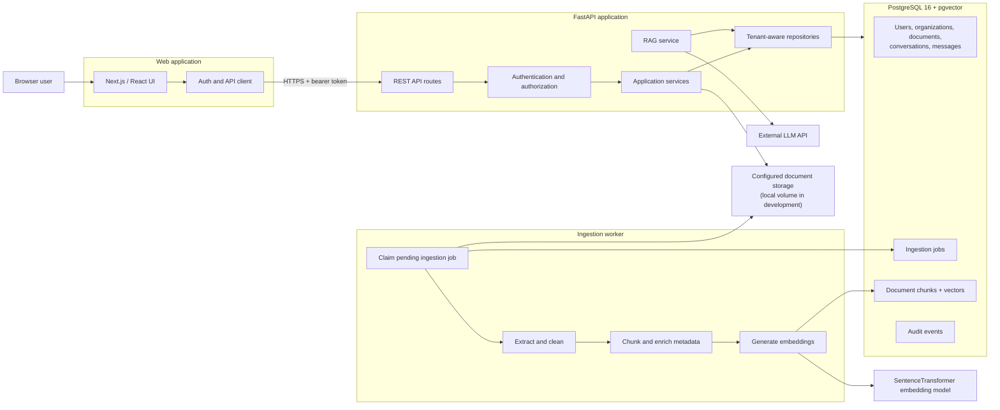
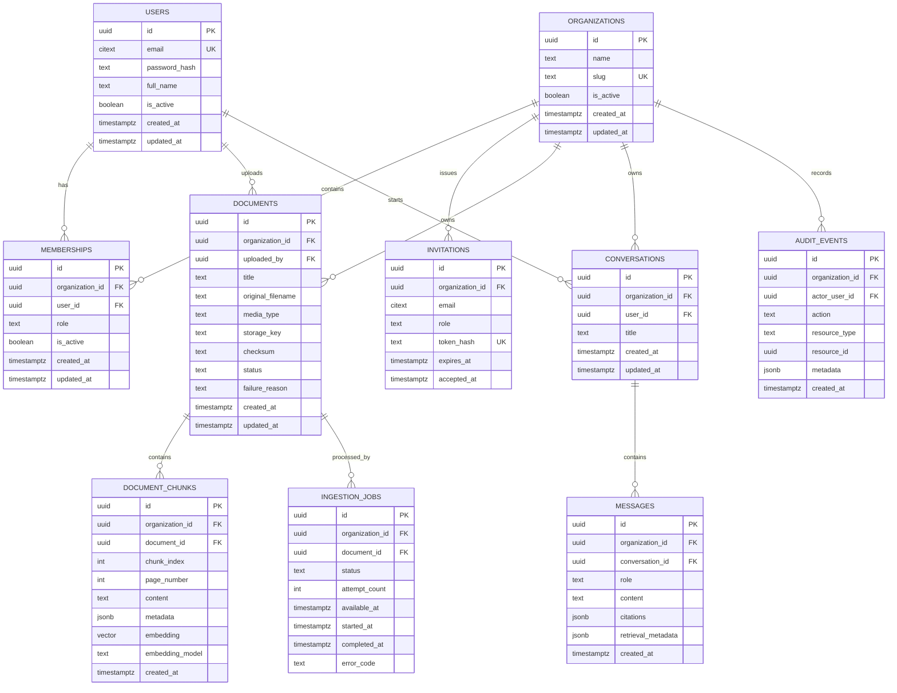
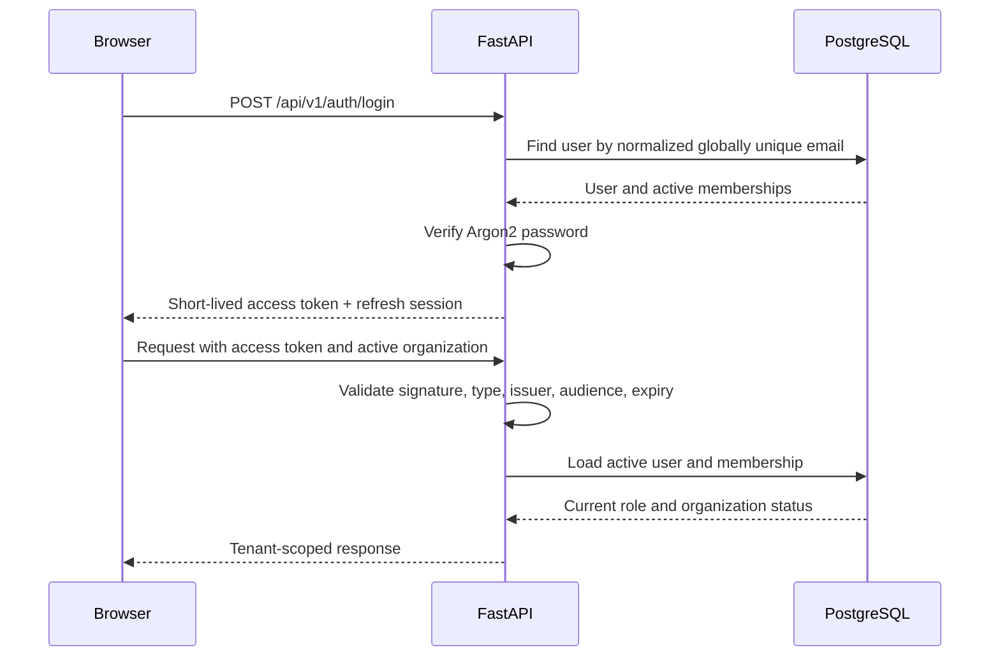
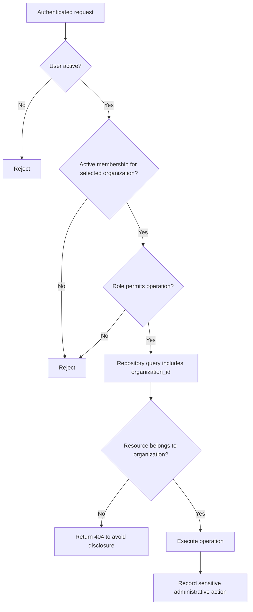
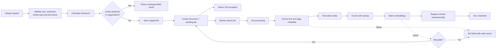
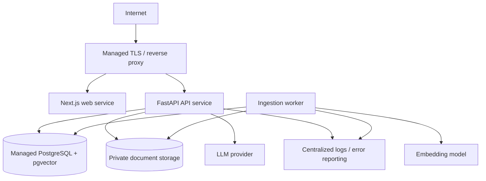

# Enterprise AI Platform Architecture

## Purpose and scope

This document defines the target architecture for the Enterprise AI Platform. It is a design for the next implementation phases, not a claim that every component already exists.

The target is a maintainable portfolio-scale application: one React/Next.js frontend, one FastAPI backend, one PostgreSQL database with pgvector, and one ingestion worker process using the same backend codebase. It deliberately avoids microservices, Kubernetes, Redis, and event-bus infrastructure.

## 1. High-level architecture



### Key decisions

- **Modular monolith:** Authentication, documents, conversations, and RAG remain modules in one FastAPI application. Their scale and deployment needs do not yet justify separately deployed services.
- **PostgreSQL as the system of record and job queue:** Ingestion jobs are persisted in PostgreSQL. A worker claims jobs with row locking. This provides durable asynchronous processing without adding Redis or a message broker.
- **Shared backend code:** The API and worker use the same schemas, repositories, configuration, and ingestion services, reducing deployment and consistency risk.
- **External LLM boundary:** LLM and embedding providers are behind small interfaces so tests can use deterministic fakes. This is not a framework-heavy provider abstraction.
- **REST rather than server actions:** The FastAPI API remains the authoritative security boundary and can be demonstrated independently through OpenAPI.

## 2. Frontend architecture

The existing Next.js App Router application remains the frontend. Duplicate chat experiences should be consolidated rather than replaced with another framework.

```text
frontend/
├── app/                     Route layouts and pages
├── components/
│   ├── auth/                Sign-in and access-control presentation
│   ├── documents/           Upload, list, details, ingestion status
│   ├── chat/                Conversations, messages, citations
│   ├── analytics/           Small operational summaries
│   ├── layout/              Navigation and workspace selector
│   └── ui/                  Reusable visual primitives
├── lib/
│   ├── api/                 Typed HTTP client and endpoint functions
│   ├── auth/                Session state and token lifecycle
│   ├── hooks/               TanStack Query hooks
│   └── validation/          Zod form schemas
└── types/                   Shared frontend domain types
```

### State ownership

- **Server state:** TanStack Query owns API results, cache invalidation, loading, and error states.
- **Authentication state:** A focused auth provider owns the current session and user. It does not become a general application store.
- **Form state:** React Hook Form and Zod handle forms with meaningful validation.
- **Local UI state:** Component state handles dialogs, selected tabs, and temporary input.
- **No global store by default:** Zustand should be removed unless a concrete cross-page client-state requirement appears.

### API boundary

- One configured HTTP client owns the API base URL, authorization header, refresh behavior, and normalized API errors.
- Endpoint functions return typed domain objects rather than exposing raw Axios responses.
- Backend OpenAPI schemas are the contract. Frontend types should either be generated from OpenAPI or maintained with contract tests; duplicate incompatible models are not acceptable.
- Authorization-related navigation improves UX but never substitutes for backend authorization.

### Route plan

| Route | Purpose |
|---|---|
| `/login`, `/register` | Authentication and organization creation |
| `/invitations/accept` | Invitation acceptance |
| `/dashboard` | Tenant-scoped overview and ingestion/query summaries |
| `/documents` | Paginated document management |
| `/documents/[id]` | Metadata, ingestion state, and authorized details |
| `/chat` | New or active conversation |
| `/conversations/[id]` | Persisted conversation and citations |
| `/members` | Owner/admin membership management |
| `/settings/profile` | User profile |
| `/settings/organization` | Authorized organization settings |

The current `/employee`, `/qa`, `/admin`, and `/hr` pages should be consolidated incrementally. Functioning components should be migrated, not rewritten solely to match the proposed paths.

## 3. Backend architecture

```text
app/
├── api/                     Thin HTTP route handlers and dependencies
├── schemas/                 Pydantic request and response models
├── services/                Use cases and transaction orchestration
├── repositories/            SQL and tenant-scoped persistence
├── rag/                     Retrieval, prompts, generation, citations
├── ingestion/               Validation, extraction, cleaning, chunking
├── security/                Tokens, password hashing, permission checks
├── observability/           Request context and safe structured logging
├── db/                      Connection pool, transactions, migrations
├── config.py                Environment-backed validated settings
└── main.py                  Application construction and middleware
```

### Responsibilities

1. **Routes**
   - Parse and validate HTTP input.
   - Resolve the authenticated principal and active organization.
   - Call one application service.
   - Map expected domain failures to consistent HTTP responses.

2. **Services**
   - Implement use cases such as uploading a document or asking a question.
   - Define transaction boundaries.
   - Enforce business rules that are not simple data access rules.

3. **Repositories**
   - Contain SQL and pagination behavior.
   - Require an `organization_id` for tenant-owned resources.
   - Never infer tenant identity from client-provided request bodies.

4. **RAG and ingestion modules**
   - Keep model-provider calls and document processing separate from HTTP.
   - Return typed results that are straightforward to unit test.

5. **Database module**
   - Provide a bounded connection pool and transaction context.
   - Replace service-level singleton connections.

### API conventions

- Prefix versioned routes with `/api/v1`.
- Return resource-oriented Pydantic schemas.
- Use cursor or page-based pagination consistently for growing collections.
- Use `201` for created resources, `202` for accepted ingestion, `204` for successful deletion where no response body is required, and standard `4xx` errors.
- Return a predictable error shape containing a stable code, message, request ID, and optional field details.
- Keep FastAPI-generated OpenAPI documentation enabled.

## 4. Database schema

The final column definitions and indexes belong to Phase 2. This conceptual schema establishes ownership and relationships.



### Important modeling decisions

- **Organizations and memberships are separate:** A user identity can belong to more than one organization without duplicate email ambiguity. Role belongs to the membership, not the user.
- **UUID public identifiers:** Tenant-owned resources use UUIDs to avoid exposing predictable global sequences. UUIDs do not replace authorization checks.
- **Organization ID on every tenant-owned table:** Even where ownership can be derived through a join, the explicit key makes policies, indexes, and defensive checks simpler.
- **Chunks retain source location:** Page number, chunk index, and metadata support reproducible citations.
- **Embedding model is recorded:** A model change can trigger controlled re-embedding instead of silently mixing incompatible vectors.
- **Messages store citation snapshots:** A historical answer should retain the citations shown at generation time even if a document later changes.
- **Audit events are selective:** Record security- and administration-relevant actions, not every read or full document content.

## 5. Authentication flow



### Authentication decisions

- Email represents one global user identity; organization access comes from memberships.
- Passwords remain Argon2-hashed.
- Access tokens are short-lived and contain only identity/session claims, not authoritative permissions.
- Current membership and organization status are checked server-side for protected operations.
- Refresh tokens should use rotation and server-stored hashes so logout and compromise response are meaningful.
- The preferred browser transport is a secure, `HttpOnly`, `SameSite` cookie for refresh state. The access-token strategy must be finalized with the deployment origin model; tokens should not be placed in long-lived local storage.
- Invitation tokens are generated randomly, stored hashed, single-use, and expire. Raw tokens are sent only through the invitation delivery path.

## 6. Authorization flow



### Initial role matrix

| Capability | Owner | Admin | Member |
|---|:---:|:---:|:---:|
| View tenant documents and ask questions | Yes | Yes | Yes |
| Manage own conversations | Yes | Yes | Yes |
| Upload and manage documents | Yes | Yes | No |
| Invite and deactivate members | Yes | Yes | No |
| Change member roles | Yes | Limited | No |
| Change organization ownership/settings | Yes | No | No |
| View tenant analytics | Yes | Yes | No |

“Owner” is intentionally distinct from “admin” so an admin cannot remove the last owner or transfer ownership without explicit rules.

## 7. Multi-tenant isolation model

Tenant isolation uses multiple layers:

1. The authenticated user selects an organization for which they have an active membership.
2. The backend derives `organization_id` from that membership, never from a resource creation payload.
3. Every repository operation for tenant-owned data requires `organization_id`.
4. Resource lookups use both resource ID and organization ID.
5. Vector search filters `document_chunks.organization_id` before ordering and limiting results.
6. Foreign keys and composite uniqueness constraints prevent inconsistent ownership.
7. PostgreSQL row-level security should be added after connection-scoped tenant context is implemented and tested. RLS is defense in depth, not a substitute for scoped repositories.
8. Automated tests attempt cross-tenant access for documents, chunks, conversations, messages, analytics, and administrative operations.

The application should generally return `404` for another tenant's resource rather than confirming that it exists with `403`.

## 8. Document ingestion pipeline



### Ingestion decisions

- Upload stores the file and durable job before returning `202`; CPU-heavy processing does not hold the request open.
- Development storage is a Docker volume behind a storage interface. A deployment can use object storage without changing document ownership logic.
- File extension, declared media type, detected type, and parser compatibility are checked. `.doc` is not advertised unless a parser genuinely supports it.
- Checksums are scoped by organization. Two organizations may upload identical content without sharing authorization.
- Chunk replacement and document completion happen transactionally.
- Failure messages exposed to users are safe; detailed parser errors remain in restricted logs.
- Worker retries are bounded and distinguish transient provider failures from invalid files.

## 9. RAG pipeline

```mermaid
flowchart LR
    Question[User question] --> Validate[Validate and normalize]
    Validate --> QEmbed[Query embedding]
    QEmbed --> Search[Tenant-filtered vector search]
    Search --> Threshold[Apply relevance threshold]
    Threshold --> Enough{Sufficient evidence?}
    Enough -- No --> Abstain[Grounded abstention]
    Enough -- Yes --> Select[Deduplicate and select chunks]
    Select --> Prompt[Construct bounded prompt]
    Prompt --> LLM[LLM generation]
    LLM --> Cite[Map answer citations to retrieved chunks]
    Cite --> Persist[Persist messages and citation snapshot]
    Persist --> Response[Answer + sources + request metadata]
```



### Prompt and retrieval security

- Retrieved text is explicitly delimited as untrusted reference material.
- System instructions state that instructions found inside documents must not be followed.
- Only chunks returned by the tenant-filtered retrieval query may be cited.
- The model is instructed to abstain when evidence is insufficient and never invent citations.
- Application code validates citation identifiers against retrieved chunks before returning them.
- Prompts and full document text are not logged by default.

### Retrieval policy

- Begin with cosine vector search and metadata filters.
- Configure `top_k` and a minimum relevance threshold through evaluated settings.
- Preserve page and chunk locations for citations.
- Add hybrid search, MMR, or reranking only when the evaluation dataset demonstrates a specific retrieval failure.
- Record retrieval duration, generation duration, total duration, retrieved chunk count, model identifiers, and whether the response abstained. These observations are not accuracy claims.

### Evaluation boundary

A version-controlled dataset should contain questions, expected relevant document/chunk identifiers, expected abstention cases, and citation expectations. Retrieval metrics, groundedness review, citation correctness, and latency are reported separately. Any LLM-judged score must be labeled as such.

## 10. Deployment architecture



### Environments

- **Local development:** Docker Compose runs PostgreSQL, API, worker, and frontend. A local volume stores uploaded files.
- **CI:** Uses an ephemeral pgvector database; runs backend lint/type checks/tests and frontend lint/type checks/tests/build.
- **Hosted deployment:** Uses one web service, one API service, one worker process, managed PostgreSQL with pgvector, and private persistent/object storage.

### Deployment decisions

- The API and worker can use the same Docker image with different commands.
- Database migrations run as an explicit release step, not automatically from every API replica.
- Secrets are supplied by the deployment platform and never baked into images or committed files.
- PostgreSQL is not publicly exposed.
- CORS uses an explicit frontend origin.
- Liveness checks confirm the process is running; readiness checks verify required database connectivity without calling paid LLM APIs.
- Backups, retention, and restore testing are deployment requirements.
- Scaling begins by adding stateless API replicas and worker replicas. PostgreSQL job claiming must use `FOR UPDATE SKIP LOCKED` so workers do not process the same job.

## Cross-cutting concerns

### Observability

Every request receives a request ID. Safe structured fields may include route, status, duration, user ID, and organization ID. AI requests additionally record retrieval, LLM, and total durations plus retrieved chunk count. Passwords, tokens, API keys, complete prompts, and document bodies are never logged.

### Error handling

Expected domain errors use stable error codes. Unexpected exceptions are logged with request context and returned as a generic error. External model failures should not expose provider details or leave ingestion records stuck in `processing`.

### Testing strategy

- Unit tests cover services, permission decisions, parsing, chunking, prompt construction, and citation validation.
- Repository integration tests run against PostgreSQL with pgvector.
- API tests exercise authentication and role boundaries.
- Tenant-isolation tests create at least two organizations and attempt cross-tenant access.
- Provider boundaries use fakes in normal CI; optional live-provider smoke tests are separate and never required for pull requests.
- Frontend tests cover auth state, form validation, error states, and the critical upload/query flows.

## Intentional tradeoffs

| Decision | Benefit | Cost or limitation |
|---|---|---|
| Modular monolith | Easier local development and interview explanation | Modules cannot be deployed independently |
| PostgreSQL job queue | Durable async work without new infrastructure | Not intended for very high-throughput distributed workloads |
| Local embedding model | Reproducible embeddings and fewer external data disclosures | Memory and startup cost per worker |
| PostgreSQL + pgvector | Transactions and vectors in one data store | Specialized vector systems may outperform it at much larger scale |
| Application scoping plus RLS | Strong defense in depth | Requires careful transaction-scoped DB context |
| REST/OpenAPI | Explicit, testable contract | More client mapping than framework-coupled server actions |

## Implementation sequence

1. Repair repository hygiene and restore a buildable frontend integration boundary.
2. Introduce controlled database migrations and the organization/membership schema.
3. Align authentication, authorization, and tenant-scoped repositories.
4. Add tenant-isolation integration tests.
5. Make ingestion durable and asynchronous.
6. Implement conversations, grounded retrieval, and citation validation.
7. Consolidate and complete the frontend.
8. Add evaluation, CI, deployment configuration, observability, and final documentation.

Each step should leave the repository demonstrably working. Architecture decisions in this document should be revised when implementation evidence reveals a simpler or safer design.
