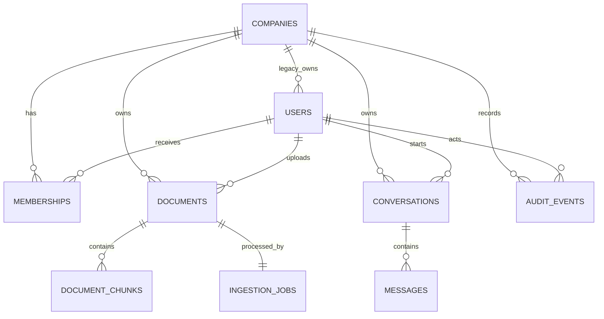

# Database Design

## Scope

PostgreSQL is the system of record for tenant identity, documents, conversations, ingestion state, and audit events. pgvector stores document embeddings alongside the relational records they belong to.

This document describes the schema introduced through:

- `scripts/init_db.py`
- `scripts/migrations/001_add_multi_tenancy.sql`
- `scripts/migrations/002_strengthen_core_schema.sql`
- `scripts/migrations/003_secure_authentication.sql`
- `scripts/migrations/004_membership_scoped_actors.sql`

Migration 002 is intentionally backward compatible with the current FastAPI application. The existing `companies` table remains the physical tenant table, and existing integer primary and foreign keys remain in place. Renaming functioning tables or replacing every key in one migration would add risk without improving tenant isolation.

## Identifier strategy

- Existing core tables retain integer internal identifiers.
- `companies`, `users`, and `documents` receive unique UUID `public_id` values for future API exposure.
- New aggregate and event tables use UUID primary keys.
- UUIDs reduce identifier enumeration and make independently created records easier to merge, but they do not provide authorization. Every tenant resource still requires an ownership check.

A later API-contract phase can move routes to public UUIDs without rewriting
internal foreign keys.

## Relationships



## Core tables

### `companies`

The existing tenant root remains named `companies` for compatibility. In product language, a company is an organization or workspace.

Important fields:

- `id`: internal integer key
- `public_id`: stable UUID for future API use
- `slug`: unique human-readable identifier
- `is_active`: tenant suspension control
- `settings`: limited tenant configuration

Subscription limit fields remain for compatibility but should not be presented as enforced until service-layer checks and tests exist.

### `users`

Users currently retain `company_id` and the legacy roles `company_admin`, `hr_manager`, and `employee`. Migration 002 adds a public UUID and validates legacy role values.

These columns remain as a compatibility bridge. Authentication and
authorization use memberships as the source of truth.

### `memberships`

Memberships separate user identity from tenant access:

- one row per user and company
- role is `owner`, `admin`, or `member`
- inactive memberships revoke access without deleting identity
- `(company_id, user_id)` is unique
- a composite foreign key ensures the transitional membership matches the user's current company

Migration 002 backfills memberships:

| Legacy role | Membership role |
|---|---|
| `company_admin` | `owner` |
| `hr_manager` | `admin` |
| `employee` | `member` |

Migration 003 removes the transitional composite user/company constraint so one
global user identity can belong to multiple organizations. The legacy
`users.company_id` and `users.role` values are no longer authoritative and can
be removed after all data consumers migrate.

### `documents`

Documents are tenant-owned metadata records. Migration 002 adds:

- original filename and media type
- storage key
- SHA-256 checksum
- ingestion status
- safe ingestion failure text
- completion timestamp
- public UUID

Allowed ingestion states are:

- `pending`
- `processing`
- `completed`
- `failed`

The active document checksum is unique within a company when a checksum exists. This supports practical duplicate prevention without preventing separate organizations from uploading identical content.

### `document_chunks`

Chunks now contain an explicit `company_id` in addition to `document_id`.

This deliberate denormalization provides:

- direct tenant filtering before vector ranking
- tenant-oriented indexing
- simpler future row-level security policies
- a composite foreign key proving the chunk and document belong to the same company

`(document_id, chunk_index)` is unique. Page number, token count, metadata, and embedding model support citations and controlled re-embedding.

The existing embedding remains `vector(384)`, matching `all-MiniLM-L6-v2`.

### `ingestion_jobs`

One durable ingestion job exists per document. It stores:

- tenant and document ownership
- pending/processing/completed/failed state
- bounded attempt count
- claim availability and lock metadata
- safe error code and detail
- processing timestamps

Workers can claim pending work in a transaction using:

```sql
SELECT id
FROM ingestion_jobs
WHERE status = 'pending'
  AND available_at <= NOW()
ORDER BY available_at, created_at
FOR UPDATE SKIP LOCKED
LIMIT 1;
```

This supports multiple workers without adding Redis. Worker behavior is implemented in the ingestion phase, not by this schema migration.

### `conversations` and `messages`

Conversations belong to both a company and the user who created them. The primary key is a UUID.

Messages:

- belong to the same company as their conversation
- have a constrained `user`, `assistant`, or `system` role
- store content
- snapshot citations shown with an answer
- store limited retrieval metadata and model identification

Citation snapshots preserve what the user saw even if a source document is later changed or deactivated.

### `audit_events`

Audit events record selected security and administration actions. They are not a copy of application logs.

Expected events include:

- membership invitation or role change
- document upload or deletion
- organization settings changes
- security-sensitive authentication events where justified

Metadata must not contain passwords, tokens, complete prompts, or document bodies.

### `refresh_sessions`

Refresh sessions store hashes of opaque random tokens. Each session belongs to
one user and membership, has an expiration, and records revocation and rotation.
The raw refresh token is never stored.

## Tenant isolation

The schema enforces tenant consistency through:

1. `company_id` on every tenant-owned table.
2. Foreign keys to the tenant root.
3. Composite foreign keys for relationships that must remain within one company.
4. Unique `(id, company_id)` indexes supporting those composite relationships.
5. Query indexes beginning with `company_id`.

Application queries must still derive company identity from the authenticated membership and include it in every tenant-owned lookup.

PostgreSQL row-level security is not enabled yet. Enabling RLS before requests
establish transaction-local tenant context would either break the current API
or create a false sense of safety. A later tenant-isolation phase should
introduce:

1. transaction-scoped `app.current_company_id`
2. policies using that setting
3. a database role that cannot bypass RLS
4. integration tests proving cross-tenant reads and writes fail

## Index rationale

### Identity and membership

| Index | Purpose |
|---|---|
| `uq_companies_public_id` | Resolve a public tenant UUID uniquely |
| `uq_users_public_id` | Resolve a public user UUID uniquely |
| `idx_memberships_user_active` | List a user's active workspaces during login or workspace selection |
| `idx_memberships_company_role_active` | List and authorize active tenant members by role |

### Documents and retrieval

| Index | Purpose |
|---|---|
| `uq_documents_public_id` | Resolve public document identifiers |
| `uq_documents_company_checksum_active` | Prevent duplicate active ingestion within one tenant |
| `idx_documents_company_active_created` | Paginate active tenant documents newest first |
| `idx_documents_company_status_created` | Filter an ingestion-status view without scanning other tenants |
| `idx_documents_company_category_active` | Support tenant category filters |
| `uq_document_chunks_document_position` | Prevent duplicate chunk positions |
| `idx_document_chunks_company_document` | Fetch or delete chunks through a tenant-scoped document lookup |
| `document_chunks_embedding_idx` | Approximate cosine nearest-neighbor search using pgvector |

The existing IVFFlat vector index is retained for compatibility. Its `lists` setting should be benchmarked against realistic data before claiming performance or replacing it with HNSW.

### Ingestion

| Index | Purpose |
|---|---|
| `idx_ingestion_jobs_claim` | Small partial index for workers claiming pending jobs in availability order |
| `idx_ingestion_jobs_company_status` | Show tenant ingestion status and history |

### Conversations

| Index | Purpose |
|---|---|
| `idx_conversations_company_user_updated` | Paginate one user's active conversations inside a tenant |
| `idx_messages_conversation_created` | Load messages in stable chronological order |
| `idx_messages_company_created` | Tenant-scoped operational lookup and retention tasks |

### Existing logs and audit records

| Index | Purpose |
|---|---|
| `idx_query_logs_company_user_created` | Query one user's tenant history newest first |
| `idx_hr_escalations_company_status_created` | Drive the tenant HR queue by status |
| `idx_audit_events_company_created` | Paginate a tenant audit trail |
| `idx_audit_events_resource` | Investigate events for one tenant resource |

Indexes are not added for every column. Each listed index corresponds to an expected authorization, pagination, worker, retrieval, or investigation query.

## Constraints

Migration 002 adds checks for:

- membership roles
- legacy user roles
- document ingestion states
- ingestion attempts
- message roles
- query confidence between zero and one
- feedback ratings from one through five
- HR escalation states

These constraints reject invalid state even if a future code path bypasses Pydantic validation.

## Migration execution

`scripts/init_db.py` now maintains `schema_migrations`.

- Each migration version is applied once.
- A migration and its ledger record commit atomically.
- A failed migration rolls back.
- Migration 001 is idempotent so databases created before the ledger can safely
  run it once more and record it atomically.
- Migration 002 fails with an explicit error if legacy rows contain invalid
  enum/rating values, duplicate chunk positions, or cross-company references.
  Those rows require deliberate data remediation; the migration does not guess
  which tenant or state is correct.
- Migration files are applied in filename order.

Production deployments should run migrations as an explicit release step before starting the new application version.

## Known transitional limitations

- Legacy identity columns remain as a compatibility bridge, but the API no
  longer uses them for authorization.
- Document uploads create ingestion jobs, and the worker processes them.
- Conversation and message APIs persist tenant-scoped chat history.
- Public UUIDs are returned for documents, but most routes still use internal
  integer identifiers.
- RLS is deferred until transaction-scoped tenant context is implemented.
- Existing timestamps from the original schema remain `TIMESTAMP`; new tables use `TIMESTAMPTZ`. Converting legacy timestamps requires an explicit timezone assumption and should not be done silently.

These limitations are intentional phase boundaries, not claims of completed functionality.
